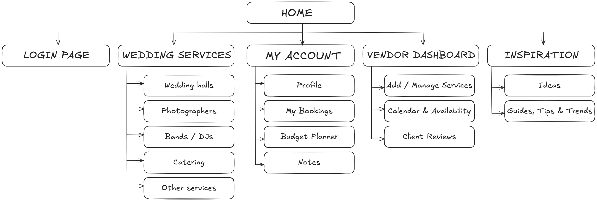

# Assignment 2: User Personas & Information Architecture

## User Personas

---

### **Petra Kovačević**

(persona1.png)

**Age:** 26  
**Occupation:** Interior designer  
**Location:** Zagreb, Croatia  
**Relationship status:** Engaged

**Personality traits:**  
🌸 Creative · Romantic · Detail-oriented · Social media savvy

**Goals:**

- Organize her dream wedding with every detail perfectly coordinated
- Explore all available options — wedding halls, decorations, dresses, flowers
- Have visual inspiration (photos, styles, mood boards) in one place

**Frustrations:**

- Overwhelmed by too many choices scattered across different sites
- Difficult to track all reservations and payments
- Hard to visualize the final look without a central planner

**Quote:**

> “I have a Pinterest board full of ideas — I just need one place to make them real.”

---

### **Marko Radić**

(persona2.png)

**Age:** 37  
**Occupation:** Financial consultant  
**Location:** Split, Croatia  
**Relationship status:** Engaged

**Personality traits:**  
🧩 Logical · Responsible · Time-conscious · Budget-focused

**Goals:**

- Plan the wedding efficiently without overspending
- Compare prices and availability easily
- Keep everything organized in one clear timeline

**Frustrations:**

- Loses patience with disorganized communication and unclear pricing
- Doesn’t enjoy scrolling through hundreds of options
- Feels that planning takes too much time away from work and personal life

**Quote:**

> “I just want it all scheduled, paid, and done — no chaos, no hidden costs.”

---

### **Ivana Marušić**

(persona3.png)

**Age:** 33  
**Occupation:** Wedding decorator & dove release service owner  
**Location:** Osijek, Croatia  
**Relationship status:** Single

**Personality traits:**  
🎀 Artistic · Empathetic · Entrepreneurial · Perfectionist

**Goals:**

- Promote her decoration and dove-release services to more couples
- Simplify bookings and manage her calendar digitally
- Collect feedback and grow her business reputation online

**Frustrations:**

- Difficult to reach potential clients without strong marketing
- Time-consuming communication with couples through social media
- Last-minute cancellations cause financial stress

**Quote:**

> “I love creating magical moments — but I need a better way to connect with clients who value what I do.”

---

## Information Architecture

1. Home

   - Overview

2. Wedding services

   - Wedding halls
   - Photographers
   - Bands / DJs
   - Catering
   - Other services

3. My account

   - Profile
   - My bookings
   - Budget planner
   - Notes

4. Vendor dashboard

   - Add / manage services
   - Calendar & availability
   - Client reviews

5. Inspiration
   - Ideas
   - Guides, tips & trends

---

## Sitemap (Visual)

---

## LLM Prompts Used

**Prompt 1 — User Personas Creation**  
Create three user personas with distinct personalities for a wedding planning web application.  
The first persona is a female user who dreams of a perfect, fairy-tale wedding and is interested in exploring all available options.  
The second persona is a male user, slightly older (middle-aged), who prioritizes simplicity and financial planning when organizing a wedding.  
The third persona is a service provider who offers wedding-related services, such as decorations, white dove releases, or similar experiences.  
Assign the remaining personality traits, goals, and motivations to each persona freely, ensuring they feel realistic and diverse.

---

**Prompt 2 — AI-Generated Persona Images**  
Generate realistic portrait photos of the three previously created user personas for the Wedora wedding planning application.  
Each image should accurately reflect the personality, age, and background of the personas.  
The portraits should look natural and professional.
