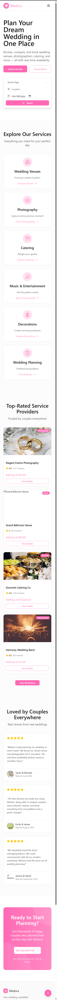

# 💍 Wedora – Landing Page UI/UX Design

Wedora is a modern digital platform designed to simplify the wedding planning process by bringing all essential services into one intuitive and visually engaging experience. This project presents a **high-fidelity UI/UX prototype** created in Figma, showcasing both **desktop and mobile versions** of the landing page.

The primary goal of the design is to help engaged couples quickly discover, compare, and book wedding services while maintaining a clean, elegant, and emotionally appealing visual identity.

---

## 🎯 Project Goals

The landing page is designed to:

- Clearly communicate the platform’s value proposition
- Allow users to instantly search for wedding services
- Present information in a structured and easy-to-scan layout
- Build trust through social proof and professional presentation
- Deliver a fully responsive experience across devices

---

## 🖥 Desktop Version

The desktop prototype focuses on a spacious and visually rich layout:

- A strong **hero section** with headline, supporting text, and a quick service search form
- Service categories displayed as **card components** (venues, photography, catering, entertainment, decoration, planning, etc.)
- A **three-step workflow** (Browse → Compare → Book) explaining the user journey
- Sections for **top-rated vendors**, **platform benefits**, and **user testimonials**
- A prominent **call-to-action** encouraging users to start planning
- A structured footer with navigation, support links, and contact information

This version emphasizes clarity, balance, and emotional appeal, suitable for users browsing on larger screens.

---

## 📱 Mobile Version

The mobile prototype translates the same experience into a compact, touch-friendly layout:

- Vertical stacking of all sections for easy scrolling
- Simplified hero section with optimized typography for small screens
- Swipe-friendly service cards
- Condensed workflow steps
- Mobile-first call-to-action placement
- Optimized spacing and tap targets for accessibility

The mobile design ensures that all core features remain accessible and visually consistent, while prioritizing usability and performance on handheld devices.

---

## 🎨 Visual Identity

The overall visual system is consistent across both versions:

- Soft pink accent color to evoke romance and elegance
- Neutral light/dark backgrounds for readability
- Clean sans-serif typography
- Rounded UI components for a friendly and modern feel
- Balanced spacing and grid alignment

---

## 📝 Design Approach

This prototype was built with a **user-centered design approach**, focusing on:

- Immediate value recognition
- Minimal cognitive load
- Clear visual hierarchy
- Emotional branding aligned with wedding context

The design is suitable as a foundation for a real-world SaaS or marketplace product in the wedding and event planning industry.

---

## 🖼 High-Fidelity Prototypes

### Desktop

### Mobile

---

## 🚀 Summary

This task demonstrates a complete landing page concept, from visual identity to responsive behavior, and serves as a strong portfolio piece for:

- UI/UX design
- Frontend development
- Product design
- Digital product prototyping
