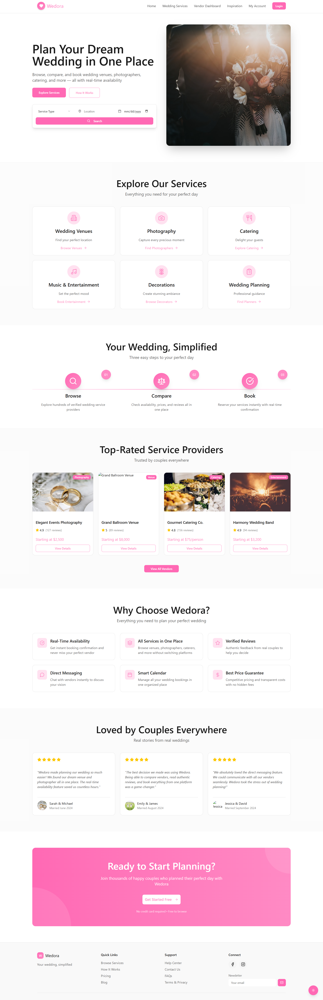

## 📝 Wedora – Landing Page Figma Prototype

This **high-fidelity Figma** prototype represents the landing page of **Wedora**, a digital platform designed to simplify wedding planning by bringing all essential services into one place. The design focuses on clarity, usability, and a modern visual identity tailored to engaged couples.

The landing page features a prominent hero section with a clear value proposition and quick service search, allowing users to immediately explore available wedding services. Below the hero section, key service categories such as venues, photography, catering, entertainment, decorations, and wedding planning are presented in a clean card-based layout.

The prototype also introduces the core workflow of the application through a **three-step process** — Browse, Compare, and Book — helping users understand how they can efficiently plan their wedding using the platform. Additionally, the page highlights top-rated service providers, key platform benefits, and real user testimonials to build trust and credibility.

A strong call-to-action section encourages users to get started, while the footer provides access to useful links, support resources, and contact options. The overall design uses consistent typography, a soft pink accent color, and balanced spacing to ensure a professional and user-friendly experience.

## High-fidelity prototype

